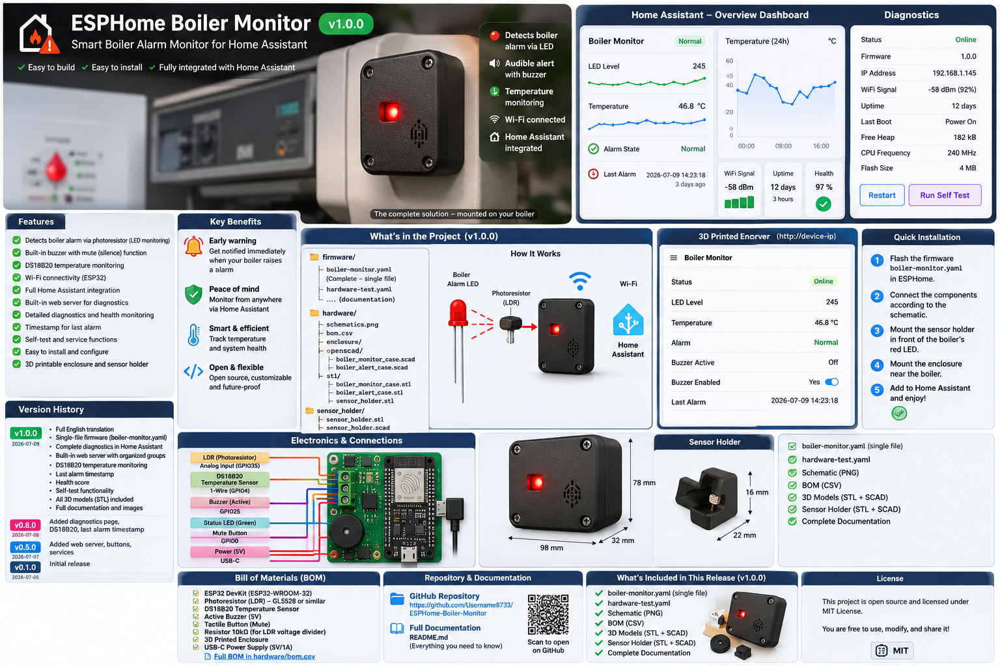

# ESPHome Boiler Monitor

[](https://esphome.io/)
[](https://www.home-assistant.io/)
[](CHANGELOG.md)
[](LICENSE)

An ESPHome-based optical alarm monitor for boilers and other equipment with a visible warning LED.



## Features

- Optical alarm detection using a phototransistor
- Adjustable threshold
- Local red alarm LED
- Green status LED
- Active 5 V buzzer through a 2N7000 MOSFET
- Physical mute button
- DS18B20 temperature sensor support
- Last-alarm timestamp
- Built-in ESPHome web interface
- Home Assistant overview and diagnostics dashboards
- Dedicated hardware-test firmware
- 3D-printable enclosure and sensor holder

## Repository structure

```text
firmware/
  boiler-monitor.yaml
  hardware-test.yaml
  secrets.yaml.example

hardware/
  bom/
  wiring/
  enclosure/
    stl/
    openscad/

docs/
  Installation.md
  Hardware-Test.md
  Calibration.md
  Diagnostics.md
  Enclosure.md
  Troubleshooting.md

homeassistant/
  overview.yaml
  diagnostics.yaml
  notifications.yaml

images/
  concept/
  functions/
```

## Quick start

1. Copy `firmware/secrets.yaml.example` values into your ESPHome `secrets.yaml`.
2. Flash `firmware/hardware-test.yaml`.
3. Verify the LEDs, buzzer, MOSFET driver, and button.
4. Build the remaining circuit using `hardware/wiring/CONNECTION_TABLE.md`.
5. Flash `firmware/boiler-monitor.yaml`.
6. Add the ESPHome device to Home Assistant.
7. Import the Home Assistant dashboard files.
8. Calibrate the optical sensor.

## GPIO mapping

| Function | GPIO |
|---|---:|
| Phototransistor analog input | GPIO34 |
| Buzzer MOSFET gate | GPIO18 |
| Red alarm LED | GPIO19 |
| Green status LED | GPIO21 |
| Mute button | GPIO22 |
| DS18B20 data | GPIO23 |

## Wiring illustrations

- [Power](images/functions/01_power.png)
- [Phototransistor sensor](images/functions/02_phototransistor_sensor.png)
- [Red alarm LED](images/functions/03_red_alarm_led.png)
- [Green status LED](images/functions/04_green_status_led.png)
- [2N7000 and buzzer](images/functions/05_mosfet_buzzer.png)
- [Mute button](images/functions/06_mute_button.png)
- [DS18B20](images/functions/07_ds18b20.png)

SVG source files are included next to the PNG images.

## Firmware

Use one of these files:

- `firmware/hardware-test.yaml` for initial hardware verification
- `firmware/boiler-monitor.yaml` for normal operation

Both are standalone ESPHome files.

## Home Assistant

- `homeassistant/overview.yaml`
- `homeassistant/diagnostics.yaml`
- `homeassistant/notifications.yaml`

When Home Assistant and the ESP32 are on different VLANs, add the ESPHome integration manually using the device IP address.

## 3D-printable files

STL and OpenSCAD files are included for:

- Boiler Alert case
- Boiler Monitor case
- Optical sensor holder

## Documentation

- [Installation](docs/Installation.md)
- [Hardware test](docs/Hardware-Test.md)
- [Calibration](docs/Calibration.md)
- [Diagnostics](docs/Diagnostics.md)
- [Enclosure](docs/Enclosure.md)
- [Troubleshooting](docs/Troubleshooting.md)

## External links

- [ESPHome](https://esphome.io/)
- [Home Assistant](https://www.home-assistant.io/)
- [ESPHome integration](https://www.home-assistant.io/integrations/esphome/)
- [Project repository](https://github.com/Username8733/ESPHome-Boiler-Monitor)

## Safety

This is a hobby monitoring accessory. It does not replace the boiler manufacturer's safety systems, alarms, inspections, or maintenance requirements.

## License

MIT. See [LICENSE](LICENSE).
